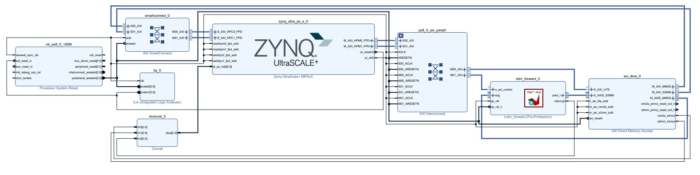
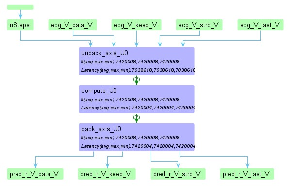
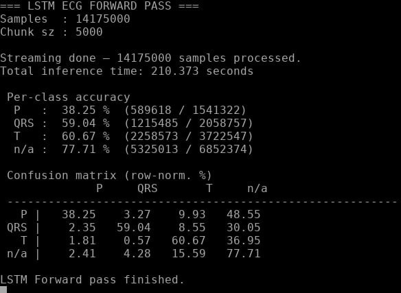

# FPGA Implementation of an LSTM Network for ECG Waveform Segmentation

This repository contains an FPGA implementation of an **LSTM neural network for ECG waveform segmentation**, deployed on a **Xilinx Zynq UltraScale+ (ZCU104)** platform.

The project demonstrates the full workflow required to deploy a trained neural network on FPGA hardware, including **model quantization, hardware design using Vitis HLS, system integration on Zynq, and on-board evaluation**.

The resulting system performs **streaming inference on ECG signals** and classifies each sample into one of four waveform classes.

---

## Project Overview

Electrocardiogram (ECG) waveform segmentation is an important task in biomedical signal processing, used to identify key cardiac events such as the **P wave**, **QRS complex**, and **T wave**.

This project implements an **LSTM-based segmentation model** on FPGA hardware. The work demonstrates how a trained neural network can be deployed as a **streaming hardware accelerator** within an embedded system.

Such implementations can support **real-time ECG analysis in embedded or wearable biomedical monitoring devices**.

Each ECG sample is classified into one of four classes:

- **P wave**
- **QRS complex**
- **T wave**
- **n/a (background)**

---

## System Architecture

The FPGA design integrates the HLS LSTM accelerator with the Zynq processing system using AXI interfaces and DMA streaming.

ECG samples are streamed from DDR memory through AXI DMA into the programmable logic, where the LSTM accelerator performs inference and outputs predicted labels.



---

## HLS Accelerator Architecture

The neural network was implemented using **Vitis HLS**, using fixed-point arithmetic and a streaming pipeline architecture.

The accelerator uses the `DATAFLOW` optimization to separate the design into independent processing stages.



Key design features include:

- Fixed-point arithmetic using `ap_fixed`
- Lookup-table implementations of nonlinear activation functions
- AXI-Stream input and output interfaces
- AXI-Lite control interface
- HLS optimization directives (`PIPELINE`, `UNROLL`, `ARRAY_PARTITION`)
- Streaming inference architecture

---

## FPGA Execution Results

The system was evaluated using **14,175,000 ECG samples**, corresponding to **2835 ECG segments of 5000 samples each**.

The bare-metal application running on the Zynq processing system:

- streams ECG samples to the accelerator via AXI-DMA
- collects predicted labels
- computes a confusion matrix
- reports per-class segmentation accuracy



---

## Repository Structure

```
fpga-lstm-ecg-accelerator
│
├── cpp_forward_pass/   Floating-point C++ reference implementation of the LSTM model
├── python_qat/         Quantization-aware training scripts used before hardware deployment
├── hls_kernel/         Vitis HLS implementation of the LSTM accelerator
├── fpga_zynq/          Bare-metal application used to run the accelerator on the Zynq platform
│
├── docs/
│   ├── images/
│   │   ├── zynq_block_design.jpg
│   │   ├── dataflow.jpg
│   │   └── fpga_results.jpg
│   │
│   ├── thesis.pdf
│   ├── presentation.pdf
│   └── paper.pdf
│
├── README.md
└── LICENSE
```

---

## Model Training Reference

The LSTM architecture used in this project was based on the MATLAB example:

**ECG Waveform Segmentation Using LSTM Networks**

https://www.mathworks.com/help/deeplearning/ug/sequence-labeling-using-lstm.html

The example served as a reference for the network architecture and dataset preparation.  
The model was subsequently adapted, quantized, and deployed as an FPGA accelerator in this repository.

---

## Documentation

Additional material related to the project is available in the `docs/` directory:

- Master's thesis describing the full system design and implementation
- project presentation summarizing the architecture and results
- research paper describing the FPGA implementation
- FPGA architecture diagrams and execution results

---

## License

This project is released under the MIT License.
